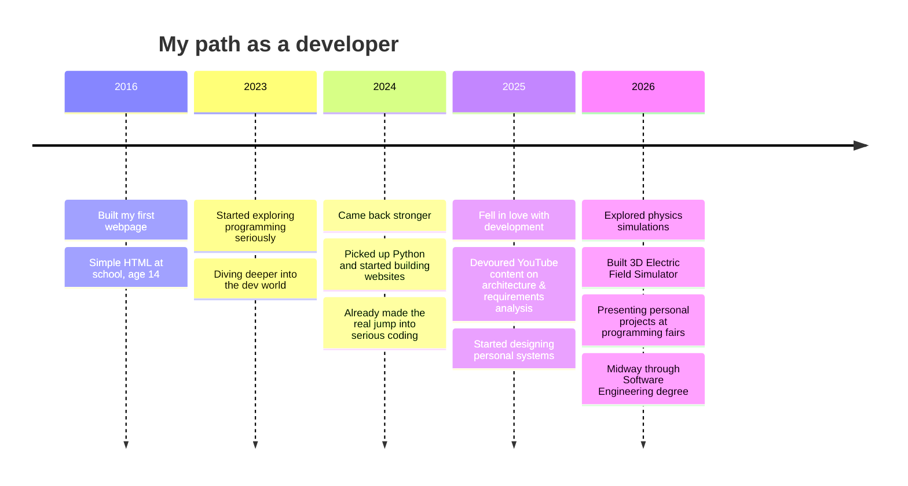

<div align="center">

<!-- ============ HERO: TYPING SVG ============ -->


<br/>

<a href="https://git.io/typing-svg">
  
</a>

</div>

<br/>

<!-- ============ ABOUT ME ============ -->
## 🌌 About Me

```yaml
name: "Diego"
role: "Full-Stack Developer / Software Engineer"
current_focus: "Distributed systems & applied AI"
learning: ["System architecture"]
philosophy: "Un alma sana habita en una mente sana y un cuerpo sano"
```

<br/>

<!-- ============ STATS EN GRID ============ -->
<div align="center">


</div>

<br/>

<!-- ============ TECH STACK ============ -->
## 🧠 Skills

<div align="center">

**Languages**


**Frontend**


**Mobile**


**Backend & Runtime**


**Databases & Backend-as-a-Service**


**Tooling & Deploy**


<br/>

<!-- ============ LIVE ACTIVITY GRAPH ============ -->
## 📡 Real-Time Activity

<div align="center">

</div>

<br/>

<!-- ============ SNAKE GAME ============ -->
## 🐍 My Contributions, Devoured by a Snake

<div align="center">

</div>


<br/>

<!-- ============ FEATURED PROJECTS ============ -->
## 🚀 Projects That Define Who I Am

<div align="center">


</div>

<br/>

<!-- ============ TIMELINE ============ -->
## 🧭 My Journey



<br/>


<!-- ============ CONNECT ============ -->
## 🌐 Find Me in the Digital Multiverse

<div align="center">

[](https://linkedin.com/in/diegopandoiglesias)
[](https://youtube.com/@DapiDev)
[](https://instagram.com/sdapi)
[](https://your-portfolio.com)

</div>

<br/>

<!-- ============ VISITOR COUNTER ============ -->
<div align="center">


</div>

<br/>

<!-- ============ CLOSING QUOTE ============ -->
<div align="center">

```text
"The code you write today is the foundation you build tomorrow on."
```


</div>
